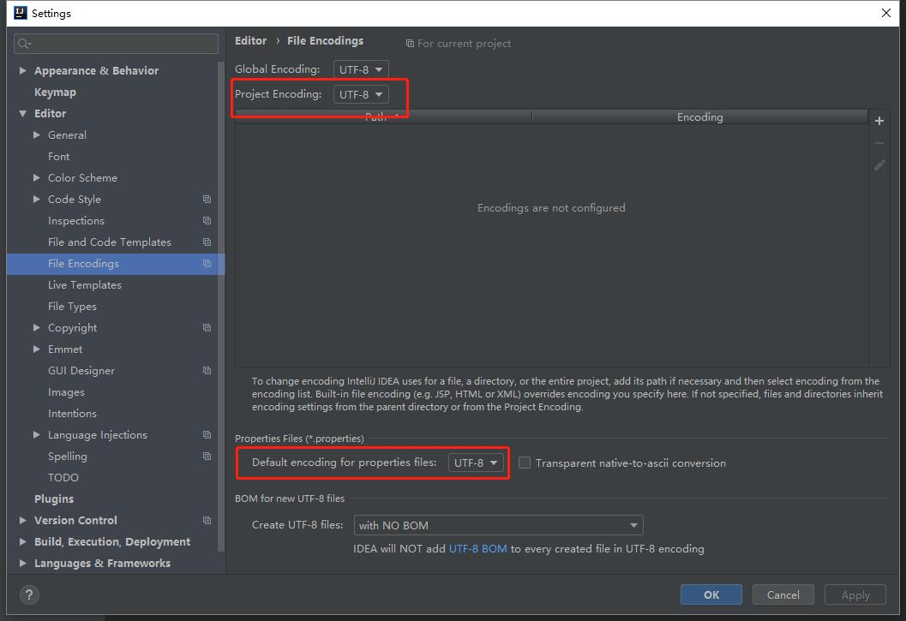
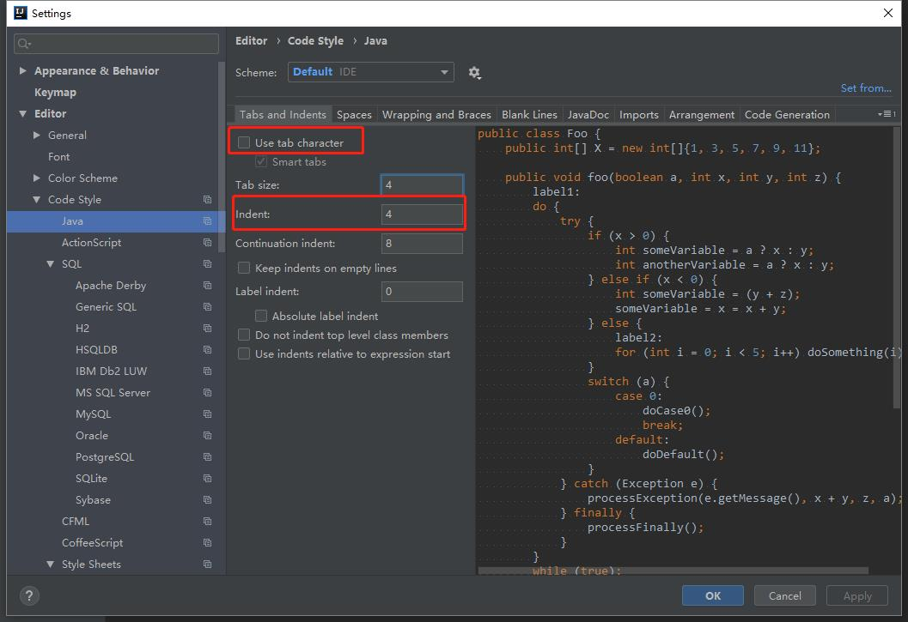
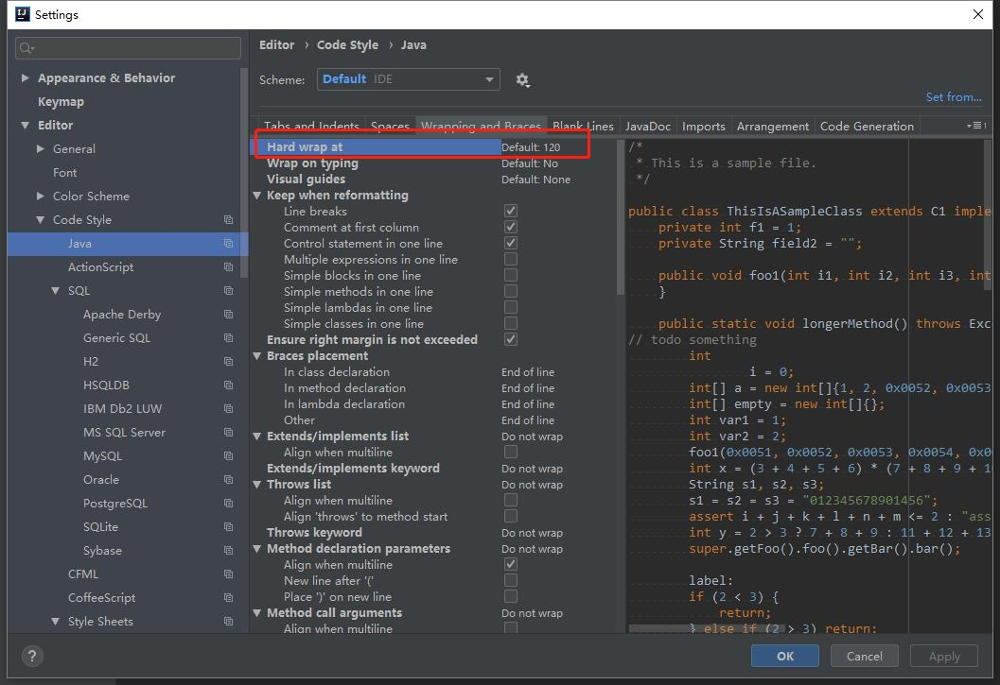
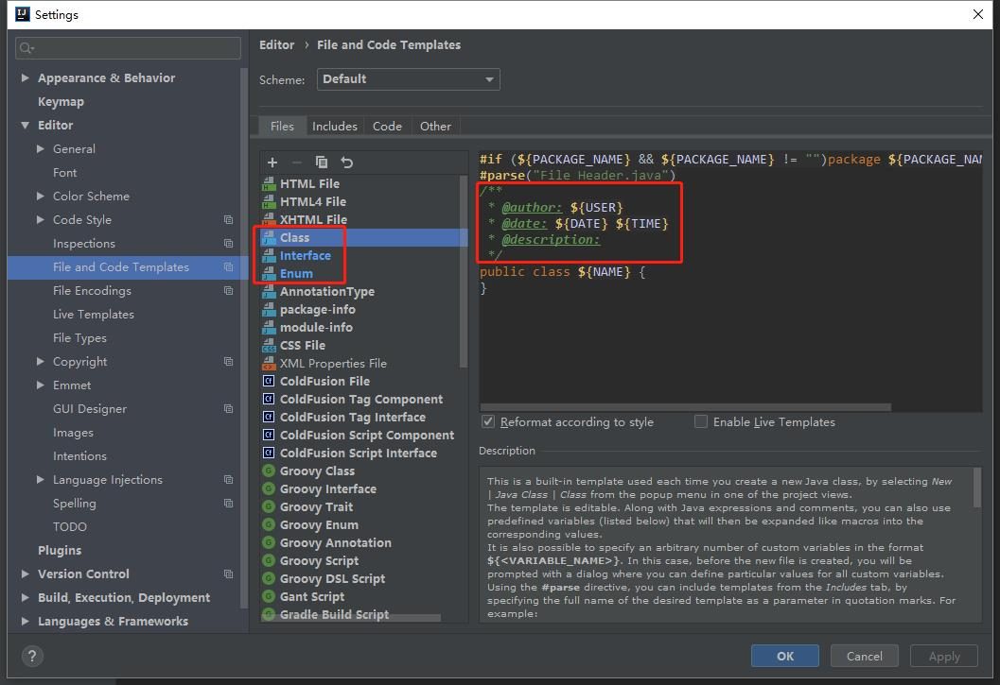

# IDE-IntelliJ Idea配置
**说明**  
我们推荐使用的IDE有两种：
- IntelliJ Idea
- Spring STS
如果你更习惯用Eclipse，配置参考下一章。  
请勿使用MyEclipse和NetBeans。  

你需要进行如下的配置：
### 1. 【强制】配置properties文件编码
到File->Settings->Editor->File Encodings，找到Properties Files，设置Project Encoding为UTF-8，并设置Default encoding for properties files为UTF-8。
IDE的text file encoding设置为UTF-8; IDE中文件的换行符使用Unix格式，不要使用Windows格式。  
  

### 2. 【强制】配置缩进
采用4个空格缩进，禁止使用tab字符。  
到File->Settings->Editor->Code Style->Java->Tabs and Indents，取消勾选“use tab character”，并设置Indent为4
  

### 3. 【强制】单行字符数限制不超过120个
到File->Settings->Editor->Code Style->Java->Wrapping and Braces，默认就是120个字符。  
  

### 4. 【强制】Java类,接口文件和枚举类文件增加创建人信息
到File->Settings->Editor->File and Code Templates，在右侧的Files中分别选择`Class/Interface/Enum`，在`public class ${NAME} {`的那一行上方添加：  
```java
/**
 * @author: ${USER}
 * @date: ${DATE} ${TIME}
 * @description: 
 */
```
  

### 5. 【强制】安装Java编码规范IDEA插件
参考[Java编码规范IDEA插件安装手册](idea-plugin/README_cn.md)  

