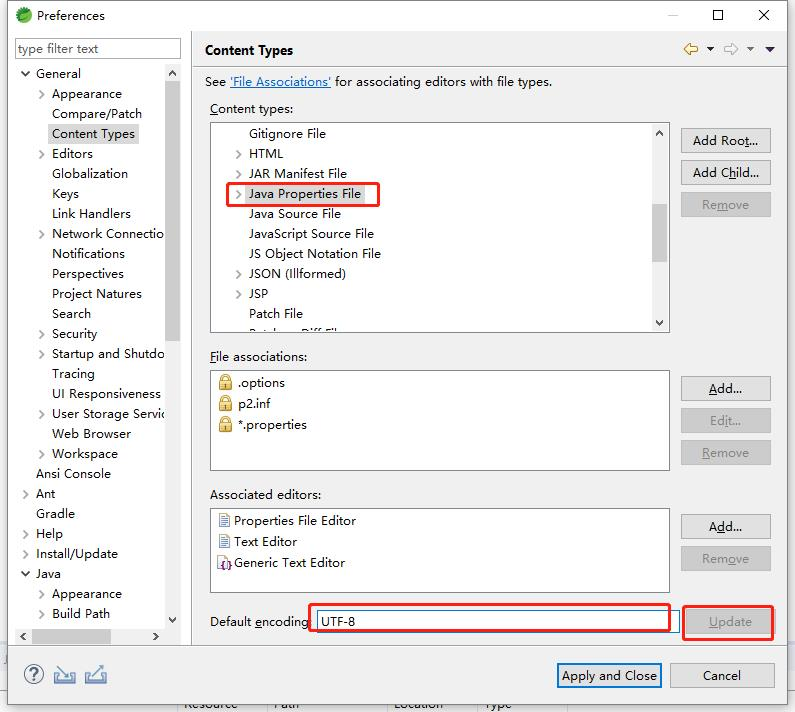

# IDE-Spring-STS配置
推荐使用STS4（截止2019年7月）。你需要进行如下的配置：  

### 1. 【强制】配置properties文件编码
调整默认文档和Properties文件编码为UTF-8
到Windows->Preference->General->Content Types，选择Text，修改Default Encoding为UTF-8，然后点击Update。  
  
然后选择Java Properties File，，修改Default Encoding为UTF-8，然后点击Update。  
  
到Windows->Preference->General->Workspace，将Text file encoding改为UTF-8。  
  

最后点击Apply and close。  

### 2. 【强制】配置缩进
采用4个空格缩进，禁止使用tab字符。  
到Window->Preferences->Java->Code Style->Formatter，点击“New”新建一个Profile，命名为pabem。  
然后选择Indentation，将Tab Policy改为“Spaces Only”，并确认“Indentation Size”为4。  
  

### 3. 【强制】单行字符数限制不超过120个
到Window->Preferences->Java->Code Style->Formatter，选择pabem的Profile，点击Edit。找到Line Wrapping，确认Maximum line width为120。  
  

### 4. 【强制】Java类,接口文件和枚举类文件增加创建人信息
到Window->Preferences->Java->Code Style->Code Templates，在右侧选择Code->New Java Files，点击Edit，在`${package_declaration}`和`${typecomment}`之间添加：  
```java
/**
 * @author: ${user}
 * @date: ${date} ${time}
 * @description: 
 */
```
  

### 5. 【强制】安装Java编码规范eclipse插件
参考[Java编码规范Eclipse插件安装手册](eclipse-plugin/README_cn.md)  