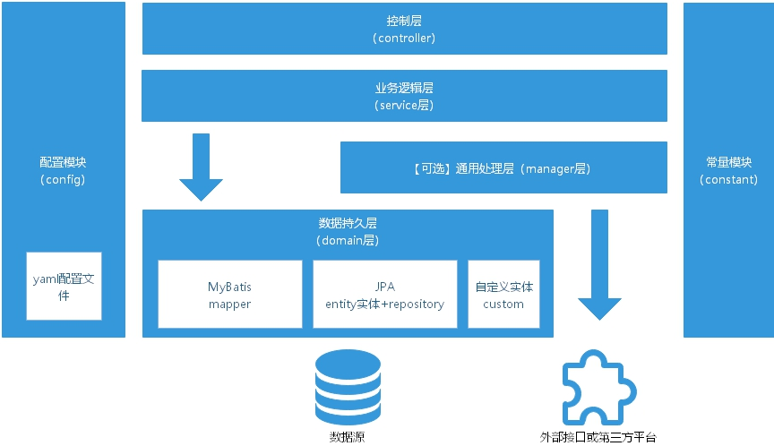

# 应用分层
### 1. 【强制】Java项目层次
   

- 控制层【controller】
  - 对访问控制的转发
  - 基本的参数校验
- 业务逻辑层【service】
  - 业务逻辑处理
- 【可选】通用处理层【manager】
  - 对第三方外部平台封装的层，预处理返回结果及转化异常信息
  - 对缓存方案、中间件通用处理
  - 多个数据持久层DAO实体的组合复用
- 数据持久层【domain层】：与底层数据库交互

对于简单项目不需要manager层，service直接依赖于domain层。  

### 2. 【强制】对于中大型项目，在controller/service/manager/domain/config/constant包下添加一层模块
例如：  
```
controller/sale
controller/deal
controller/activity
```

### 2. 【强制】每个有配置的模块都需要自己的Config类，每个模块都需要自己的Constant类
**推荐**使用以下方式使用Config类进行配置：  
```java
@Configuration
@ConfigurationProperties(prefix = "<模块前缀>", ignoreUnknownFields = false)
```
**不推荐**使用`@Value`的方式使用配置。  

### 3. 【强制】JPA的@Entity实体和@Repository仓库分别放在domain/模块/entity和domain/模块/repository路径下

### 4. 【强制】MyBatis的Mapper接口放在domain/模块/mapper路径下

### 5. 【强制】自定义实体放在domain/模块/custom路径下
入参请求实体的命名推荐使用`XXXRequest`  
返回实体的命名推荐使用`XXXResponse`  

### 6.【推荐】对于计算参数的需求尽量交给前端，后端只需返给原值
**正例**  
当金额在前端展现的时候需要增加千分位/显示为中文金额，由前端来实现。后端只返回原始金额。  